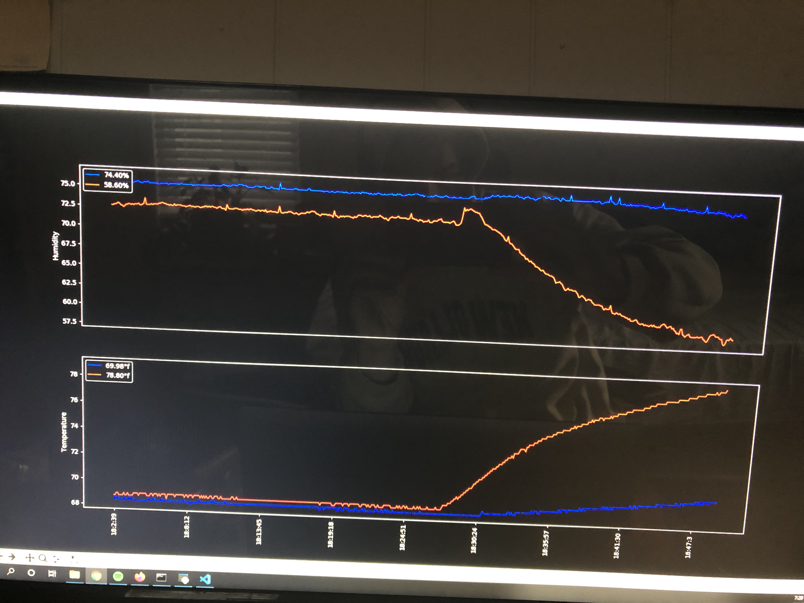
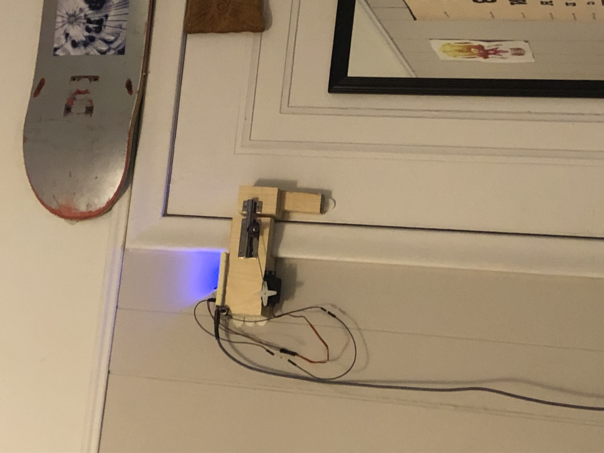

# Alfred-Src
All code related to room nodeMCU's

This project was an effort to automate different parts of my room. This was accomplished using ESP8266 micro controllers also known as Node MCUs. Multiple of these controllers were set up for different tasks, each running a server which I connected to with an old chromebook I put Ubuntu on.

---

## Bart Monitor

Before relocating to Boston I owned a ball python named Bart. I was new to caring for a ball python and was worried about keeping the correct temperature and humidity within his tank. I came up with the idea of setting up a micro controller hooked up to a couple of temperature humidity sensors to keep a live plot of the hot and cold sides of his tank. The sensors I ended up using were SNS-DH11 digital temperature humidity sensors. The code for the ESP8266 can be found in bartMonitor.ino.

This data was recieve by the chromebook and displayed as a live plot. Code for the client graph can be found in bartClient.py. Below is the result of turning on the over head heat lamp for a about 15 minutes.

## Door Lock

This abomination of wood and hotglue is what I used to lock and unlock my door. It had a button to manually toggle the bolt as well as a client program that could remotely toggle it. ESP8266 code is in doorLock.ino and client code is in alfred_gui.py.

## Speech to text

I began eperimenting with googles text to speech apis in hopes that I could use that to control the door, but this and my other ambitions for the project never came to fruition because I got too busy with school.
